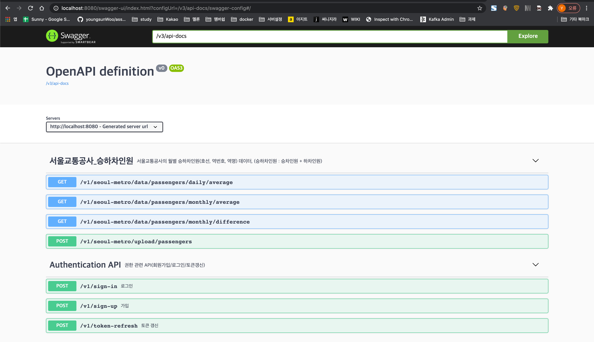
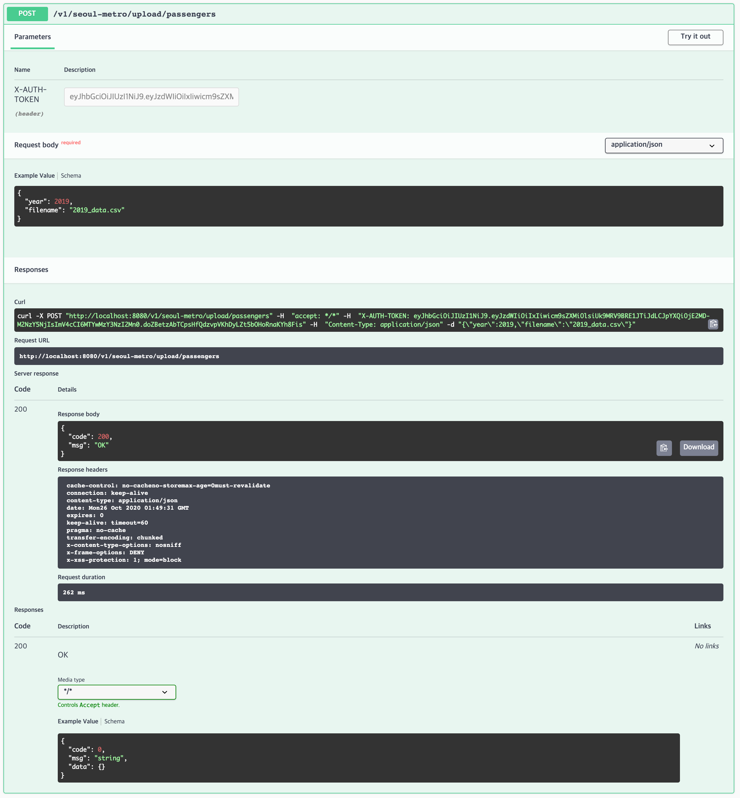
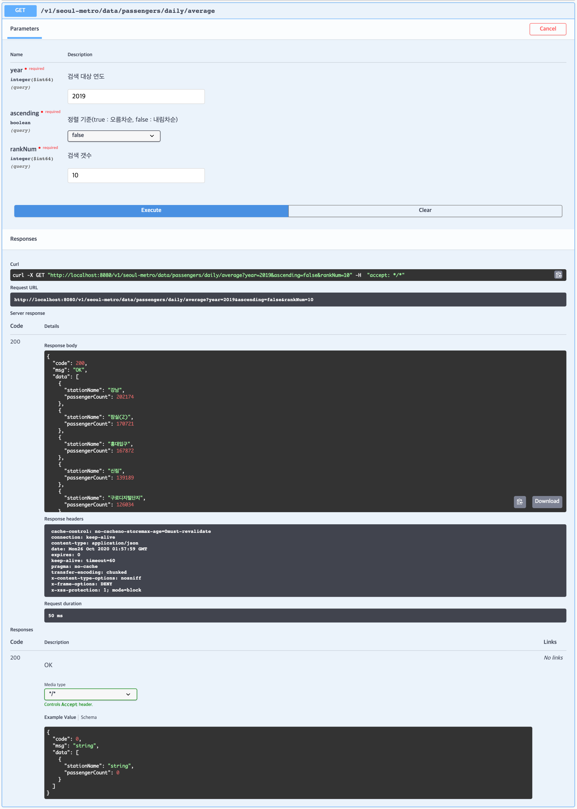
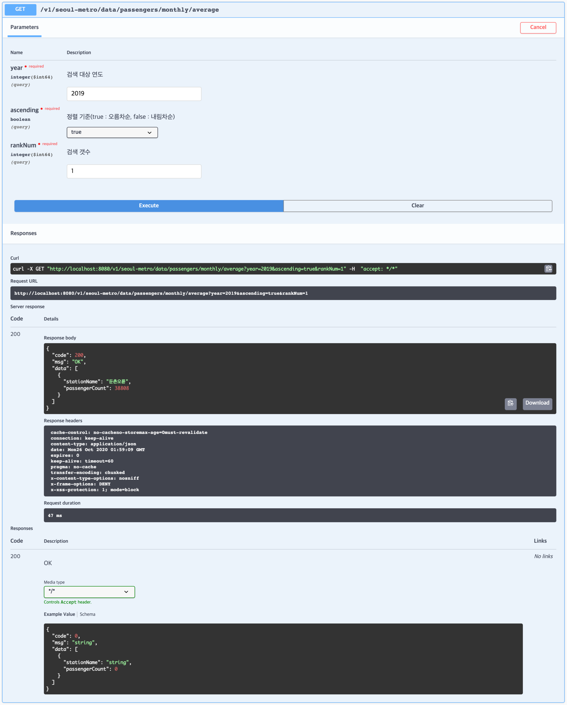
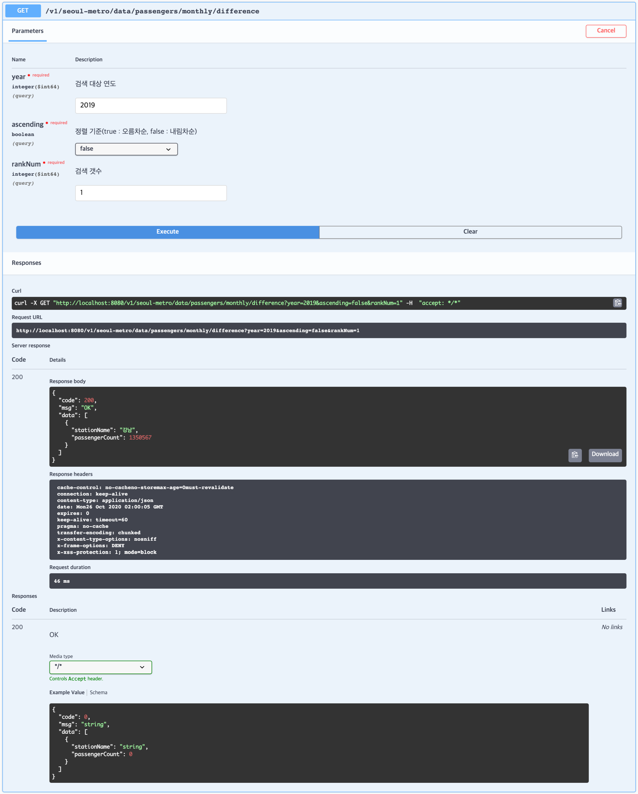
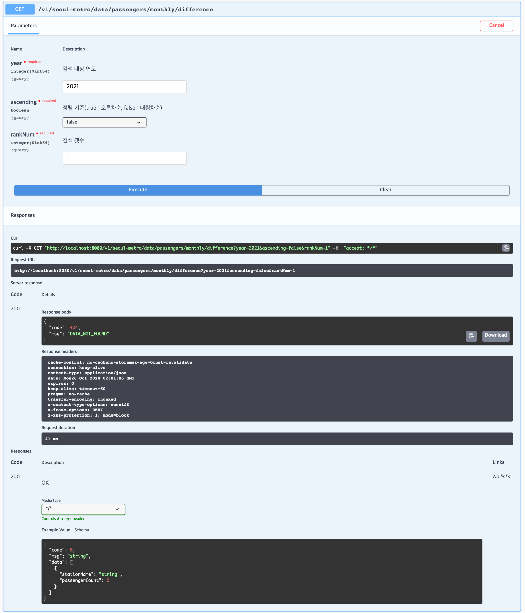
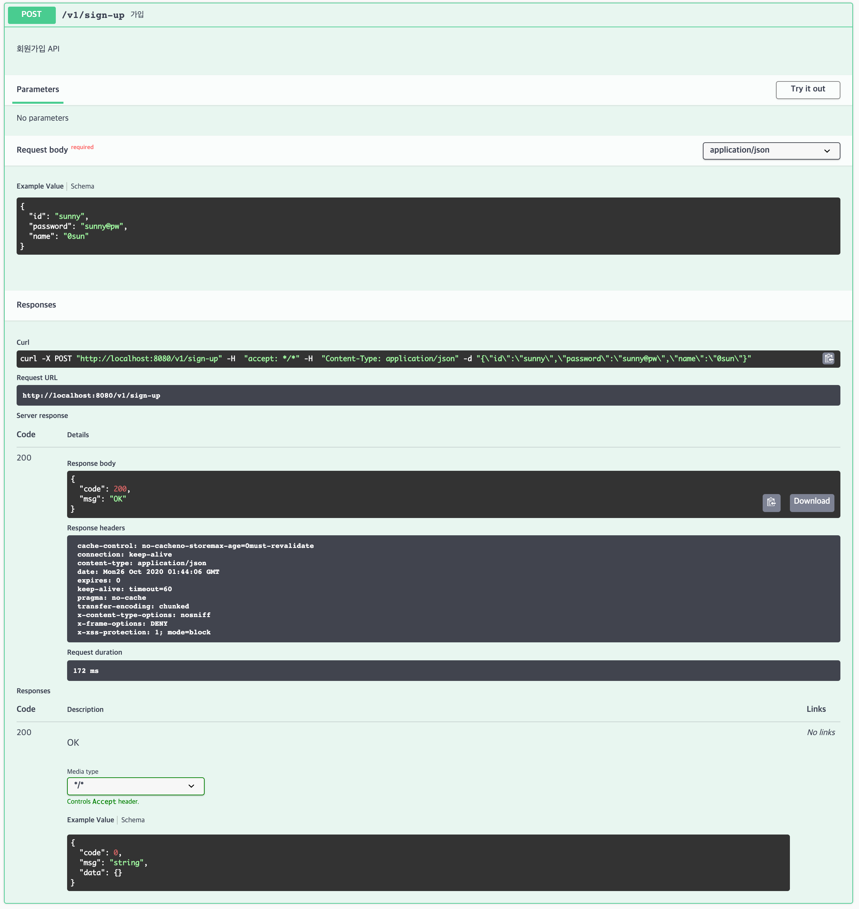
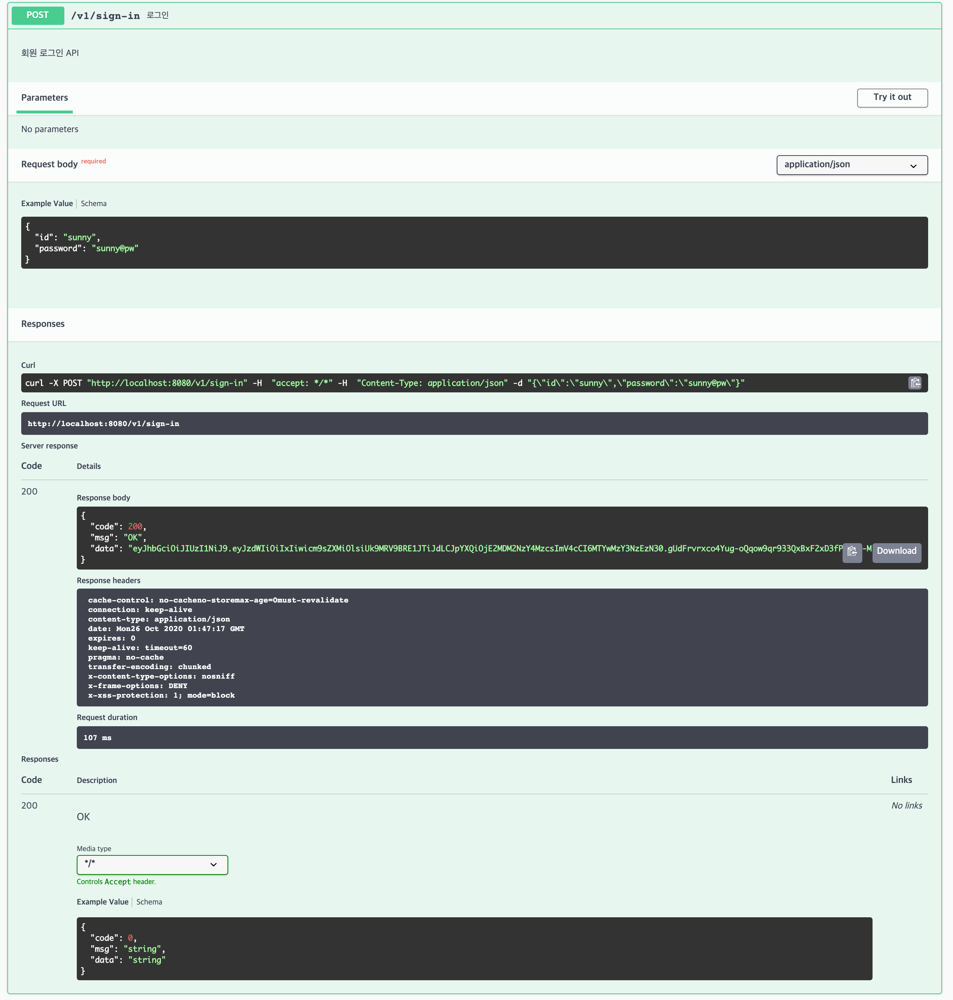
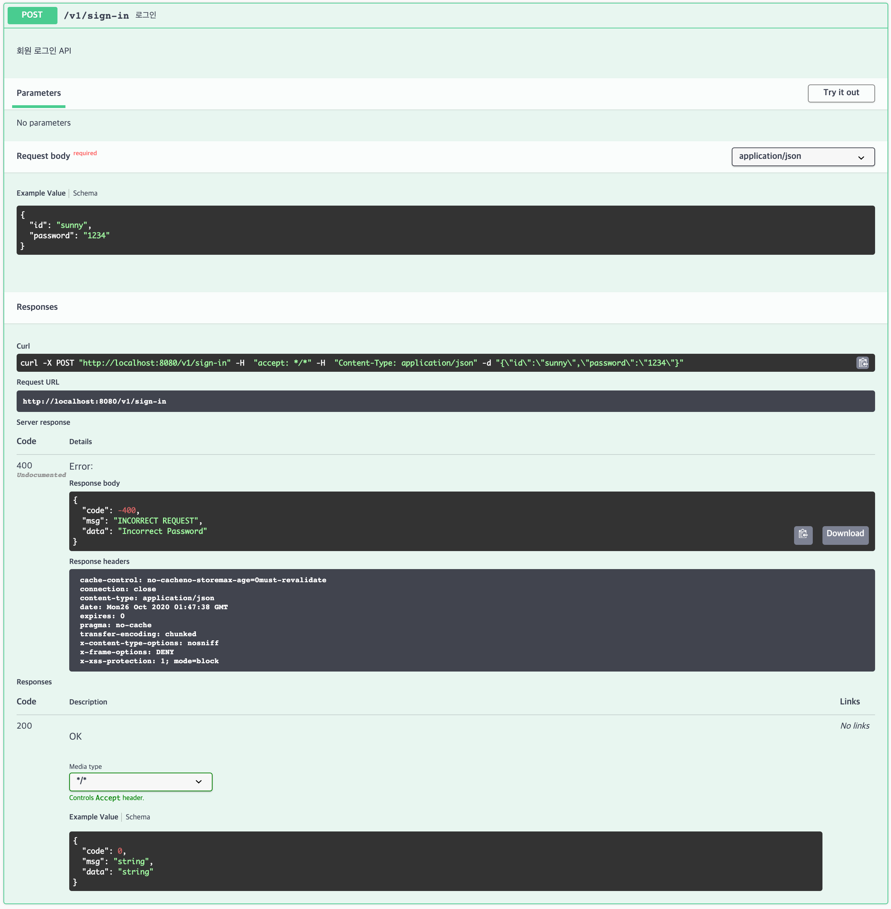
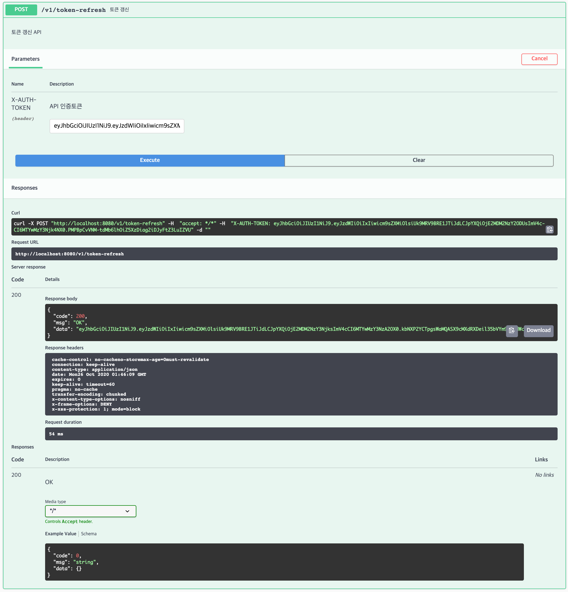

# 서울교통공사 승하차 순위 데이터 적재 및 조회용 API 개발

## 목차
- [빌드 및 실행](#빌드-및-실행)
- [개발환경 및 라이브러리](#개발환경-및-라이브러리)
- [고려 사항](#고려-사항)
- [과제 요구사항 및 결과](#과제-요구사항-및-결과)
- [고려 사항](#고려-사항)
- [시연](#시연)

## 빌드 및 실행
### 터미널 환경
Java(openjdk 1.8), Docker는 설치되어 있다고 가정한다.

**Builf the Application** 
```
$ ./gradlew build
```
**Run the Application** 
```
$ ./gradlew bootRun
```
**Run the Application With Docker**
```
$ ./gradlew bootBuildImage 
$ docker run -p 8080:8080 -t assignment:0.0.1-SNAPSHOT
```

## 개발환경 및 라이브러리

#### openkdk 1.8
- 무료로 사용 가능한 오픈소스 기반의 openjdk 1.8 버전을 사용

#### Spring 2.3.4
- 도커 컨테이너 환경으로 실행 할 수 있도록 공식적으로 이미지 빌드를 지원하는 2.3.X 이상의 버전
- 그 중 현재(2020.10) 가장 최신 버전인 2.3.4 사용

#### gradle 

#### Spring Security
- REST API 인증(Authentication) 구현  
- 별도의 저장소가 필요 없는 JWT를 이용해 Access Token 관리 
- Access Token의 유효시간조정과 토큰 갱신 구현으로 Access Token 탈취 대응 

#### JPA 
- DB 입출력 구현
- DBMS/구조변경 등의 유지보수성을 고려 
- 비슷한 조건으로 빈번한 조회가 될 상황을 고려해 캐싱기능을 제공하는 JPA를 사용해 성능향상

#### log-back
- 로깅처리
- SLF4J의 구현체로 다른 로깅프레임웤 전환시에도 용이 
- 스프링 부트의 기본으로 포함되어 있어 별도로 라이브러리 추가가 필요없으며 application.properties 설정으로 적용가능 
- log4j, log4j2에 비해 성능이 우수함

#### Springdoc
- API 문서 작성 및 시연화면 구현
- Spring fox에 비해 후발주자로 사용성이 편리하고 버그대응을 잘하는 Springdoc 사용
- Springdoc vs Springfox  

|구분|출시|릴리즈현황|기타|
|--|-----|---|---|
|Springdoc|2019년 7월(v.0.0.4) |출시이후 꾸준히 릴리즈| 정식버전에서 WebFlux지원|
|Springfox|2015년 6월(v.2.0.1)|2018.06-2020.06까지 약 2년간 중단<br>최근 다시 릴리즈| 정식버전에서 WebFlux 지원불가|

#### UniVocity Parsers
- CSV 파일 파싱 구현
- 2020이후 릴리즈 버전이 존재하는 라이브러리중 가장 처리 속도가 빠른 UniVocity 사용
- 라이브러리 선정기준   
    - 안정성   
        - 사용량이 가장 많은 라이브러리 Top 10중에 선정  
        - 2020 이후 릴리즈 되지 않은 라이브러리 제외 
    - 성능  
        - JDK8 기준 가장 처리속도가 빠른 라이브러리 Top 10 선정
        - 성능측정 조건 : JDK 8 / 3,173,958 rows / 모든 data에 "(quotes)가 존재 경우  
- CSV 파싱 라이브러리 사용현황  

|순위|라이브러리|사용량|최신 릴리즈|
|--|-----|---|---|
|1 |Apache Commons CSV            | 763 usages |2020.02|
|2 | ~~OpenCSV~~                  | 608 usages |2011.07|
|3 |OpenCSV                       | 316 usages |2020.05|
|4 |~~JDBI~~                      | 200 usages |2017.01|
|5 |Data CSV                      | 159 usages |2020.02|
|6 |Jackson Dataformat CSV        | 134 usages |2020.10|
|7 |~~Super CSV Core~~            | 132 usages |2015.10|
|8 |**`UniVocity Parsers`**       | 125 usages |2020.08|
|9 |~~Scala CSV~~                 | 85 usages  |2019.10|
|10|~~Java CVS Reader and Writer~~| 70 usages  |2008.02|
 
- CSV 파싱 라이브러리 성능비교  

|순위|라이브러리|평균속도|성능대비 % |최소수행시간 |최대수행시간|  
|--|-----|---|---|---|---|
|1|**`uniVocity CSV parser`**|	855 ms|	Best time!|	839 ms|	870 ms|  
|2|SimpleFlatMapper CSV parser|	964 ms|	12%	|959 ms|	971 ms|  
|3|Jackson CSV parser|	1023 ms|	19%	|1009 ms|	1058 ms|  
|4|Diergo Easy CSV Streamable|	1385 ms|	61%	|1378 ms|	1394 ms|  
|5|Product Collections parser|	1388 ms|	62%	|1386 ms|	1391 ms|  
|6|Java CSV Parser|	1642 ms|	92%	|1635 ms|	1650 ms|  
|7|JCSV Parser|	1756 ms|	105%	|1739 ms|	1765 ms|  
|8|Simple CSV parser|	1813 ms	|112%	| 1804 ms |	1841 ms|  
|9|Gen-Java CSV|	1954 ms|	128%	|1950 ms|	1961 ms|  
|10|SuperCSV|	1989 ms|	132%	|1975 ms|	2001 ms|  

## 고려 사항 

#### API 인증
- 데이터파일(.csv)저장 API는 인증 필요 
- 조회 API는 누구나 사용 가능
 
#### API 설계
- REST API 
  - HTTP Method와 URI만으로 API의 기능을 유추 가능
    - HTTP Method   
      >GET : 조회    
      POST : 저장  
    - URI  
      >/v1/seoul-metro/passengers/daliy/average  
      &nbsp;&nbsp;&nbsp;&nbsp;&nbsp;&nbsp;&nbsp;(서울지하철) /&nbsp;&nbsp;&nbsp;&nbsp;&nbsp;(승객)&nbsp;&nbsp;&nbsp;&nbsp;&nbsp;/(일간)/&nbsp;&nbsp;(평균)   
      /v1/seoul-metro/passengers/monthly/average  
      &nbsp;&nbsp;&nbsp;&nbsp;&nbsp;&nbsp;&nbsp;(서울지하철) /&nbsp;&nbsp;&nbsp;&nbsp;&nbsp;(승객)&nbsp;&nbsp;&nbsp;&nbsp;&nbsp;/&nbsp;&nbsp;(월간)&nbsp;&nbsp;/&nbsp;&nbsp;(평균) 
      
- 확장성/재사용성 
  - 다른 연도의 자료 대응
     - 저장할 데이터의 연도를 request parmeter으로 전달 받아 저장 
    - 조회시 연도를 request parmeter로 전달받아 조건으로 사용
  - 파일이름이나 경로가 변경 대응  
    - 파일명을 request parmeter로 전달 받음  
    - 파일 경로는 apllication.yaml에 명시해 변수로 주입받아 사용   
  - api 조회조건 변경 대응 가능
    - 상위/하위 : 정렬기준을 request parmeter로 전달받아 조건으로 사용 
    - 출력 갯수 : 출력할 갯수를 request parmeter로 전달받아 조건으로 사용

#### DB 인덱싱
- DB INDEX
  - 파일은 연도별 파일로 해당 자료의 `입력(insert)`은 1회/연 발생으로 가정 
  - 자료의 `수정(update)` 및 `삭제(delete)` 는 거의 발생하지 않을 것으로 가정
  - 이후 주 요청은 `조회(read)`로 예상
  - 따라서 index를 추가해도 입력/수정/삭제의 성능 저하보다 조회의 성능 향상을 우선하여 인덱스를 생성

## 과제 요구사항 및 결과
### 필수사항
#### 1. API 명세서 작성
- swagger 문서로 대체
#### 2. 데이터파일(.csv)의 각 레코드를 데이터베이스에 저장하는 API 개발
- Request
  - url
  ```
  POST http://localhost:8080/v1/seoul-metro/data/passengers/daily/average
  ```
  - header
  ```
  "X-AUTH-TOKEN: {token}"
  ``` 
  - parameter
  ```
  {
    "year": 2019,
    "filename": "2019_data.csv"
  }
  ```  
- Response
  ```
    {
      "code": 200,
      "msg": "OK"
    }
  ```
#### 3. 일평균 인원이 가장 많은 상위 10개의 역 명과 인원 수를 출력하는 API 개발
- Request
  - url
  ```
  GET http://localhost:8080/v1/seoul-metro/data/passengers/daily/average
  ```
  - parameter
  ```
  {
    "year": 2019,        //조회 대상 연도
    "ascending": false,  //정렬기준(true:오름차순, false:내림차순 )
    "rankNum": 10        //출력갯수
  }
  ```  
- Response
   ```
    {
      "code": 200,
      "msg": "OK",
      "data": [
        {
          "stationName": "강남",
          "passengerCount": 202174
        },
        {
          "stationName": "잠실(2)",
          "passengerCount": 170721
        },
        {
          "stationName": "홍대입구",
          "passengerCount": 167872
        },
        {
          "stationName": "신림",
          "passengerCount": 139189
        },
        {
          "stationName": "구로디지털단지",
          "passengerCount": 126034
        },
        {
          "stationName": "고속터미널(3)",
          "passengerCount": 121245
        },
        {
          "stationName": "삼성",
          "passengerCount": 121183
        },
        {
          "stationName": "신도림",
          "passengerCount": 118081
        },
        {
          "stationName": "서울역(1)",
          "passengerCount": 111771
        },
        {
          "stationName": "서울대입구",
          "passengerCount": 105143
        }
      ]
    }
  ```

#### 4. 월 인원수 평균이 가장 낮은 역 명과 인원수를 출력하는 API 개발
- Request
  - url
  ```
  GET http://localhost:8080/v1/seoul-metro/data/passengers/monthly/average
  ```
  - parameter
  ```
  {
    "year": 2019,        //조회 대상 연도
    "ascending": true,   //정렬기준(true:오름차순, false:내림차순 )
    "rankNum": 1        //출력갯수
  }
  ```  
- Response
  ```
    {
      "code": 200,
      "msg": "OK",
      "data": [
        {
          "stationName": "둔촌오륜",
          "passengerCount": 38808
        }
      ]
    }
  ```

#### 5. 월 인원수 최대 최소의 차이가 가장 큰 역 명을 출력하는 API 개발
- Request
  - url
  ```
  GET http://localhost:8080/v1/seoul-metro/data/passengers/monthly/difference
  ```
  - parameter
    ```
    {
      "year": 2019,        //조회 대상 연도
      "ascending": false,   //정렬기준(true:오름차순, false:내림차순 )
      "rankNum": 1        //출력갯수
    }
    ```  
- Response

  ```
    {
      "code": 200,
      "msg": "OK",
      "data": [
          {
            "stationName": "강남",
            "passengerCount": 1350567
          }
      ]
    }
  ```  
### 선택사항 - API 인증(Authentication)
#### 1. 회원가입 
- Request
  - url
  ```
  POST http://localhost:8080/v1/sign-up
  ```
  - parameter
  ```
  {
    "id": "suuny",
    "password": "test",
    "name": "0sun"
  }
  ```

- Request
  ```
  {
    "code": 200,
    "msg": "OK"
  }
  ```
#### 2. 로그인(토큰발급)
- Request
  - url
  ```
  POST http://localhost:8080/v1/sign-in
  ```
  - parameter
  ```
  {
    "id": "suuny",
    "password": "test",
  }
  ```

- Request
  ```
  {
    "code": 200,
    "msg": "OK",
    "data": {token}
  }
  ```

#### 3. 토큰갱신
- Request
  - url
  ```
  POST  http://localhost:8080/v1/token-refresh
  ```
  - header
  ```
  "X-AUTH-TOKEN: {token}"
  ```
- Request
  ```
  {
    "code": 200,
    "msg": "OK",
    "data": {token}
  }
  ```


## 시연
#### [http://localhost:8080](http://localhost:8080/swagger-ui/index.html?configUrl=/v3/api-docs/swagger-config/)
- (참고) 과제실행화면

#### 필수사항
1. API 명세서 작성
 
2. 데이터파일(.csv)의 각 레코드를 데이터베이스에 저장하는 API 개발
 
3. 일평균 인원이 가장 많은 상위 10개의 역 명과 인원 수를 출력하는 API 개발
 
4. 월 인원수 평균이 가장 낮은 역 명과 인원수를 출력하는 API 개발
 
5. 월 인원수 최대 최소의 차이가 가장 큰 역 명을 출력하는 API 개발
 
(참고)데이터 미 존재시 응답
 

### 선택사항 - API 인증(Authentication)
1. 회원가입 
 
2. 로그인(토큰발급)
- 로그인 성공
 
- 로그인 실패
 

토큰갱신
 


